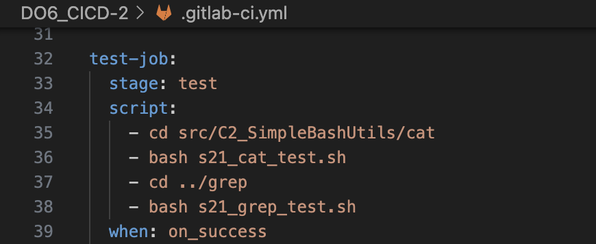
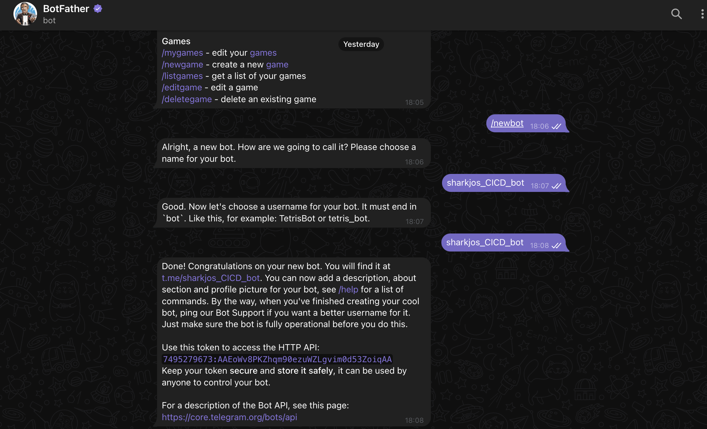

# Part 1. Настройка gitlab-runner

1) Подняли виртуальную машину Ubuntu Server 22.04 LTS.

2) Запустили скрипт, который выполняет установку репозитория ***gitlab-runner***
  

3) Установили на виртуальную машину ***gitlab-runner***

4) Запустили ***gitlab-runner*** и зарегистрировали его для использования в текущем проекте (DO6_CICD).

# Part 2. Сборка

1) Написали этап для CI по сборке приложений из проекта C2_SimpleBashUtils:
   - В файле gitlab-ci.yml добавли этап запуска сборки через мейк файл из проекта C2.
   - Файлы, полученные после сборки (артефакты), сохрани в произвольную директорию со сроком хранения 30 дней.

 2) Видим этап сборки в пайплайне (прошел успешно)

# Part 3. Тест кодстайла

1)  Написали этап для CI, который запускает скрипт кодстайла (***clang-format***).

   - Наблюдаем этап кодстайла (пайплайн «зафейлен» по заданию)

   - В пайплайне отобразили вывод утилиты ***clang-format*** (пайплан "success")

# Part 4. Интеграционные тесты

1) Написали этап для CI, который запускает твои интеграционные тесты из того же проекта.

   - Запустили этот этап автоматически только при условии, если сборка и тест кодстайла прошли успешно.

   - Этапы пайплайна

- В пайплайне отобразили вывод, что интеграционные тесты успешно прошли / провалились.

# Part 5. Этап деплоя

1) Подняли вторую виртуальную машину Ubuntu Server 22.04 LTS.

2) Написали  этап для CD, который «разворачивает» проект на другой виртуальной машине.
   - Запустили этот этап вручную при условии, что все предыдущие этапы прошли успешно.
   - Добавили этап deploy в файл .gitlab-ci.yaml
   - В файл gitlab-ci.yml добавили этап запуска написанного скрипта.

3)  Написали bash-скрипт, который при помощи ssh и scp копирует файлы, полученные после сборки (артефакты), в директорию 
***/usr/local/bin*** второй виртуальной машины.

4) Задаем пароль командой `sudo passwd gitlab-runner`
5) Добавим пользователя ***gitlab-runner*** в группу ***sudoers*** с помощью команды 
   `sudo usermod -aG sudo gitlab-runner`

6) Далее сгенерируем ***ssh*** ключ командой `ssh-keygen`

7) Cкопируем ***ssh*** ключ на вторую машину 

8) Проверяем, что ключ скопировался на вторую машину

9) Изменяем права доступа на второй машине к директории ***/usr/local/bin*** с помощью команды 
`sudo chmod -R 777`  Давая права 777, мы предоставлям полный доступ (чтение, запись и выполнение) к этим файлам и директориям для всех пользователей 

   - После пуша стадия деплой ждёт запуска вручную

   - Вывод пайплайна:

   - Файлы ***s21_cat*** и ***s21_grep*** появились в директории **/usr/local/bin** на второй машине:

# Part 6. Дополнительно. Уведомления

1) Напишем `@botfather` в telegram, чтобы создать бота и получить его токен:

2) Напишем `@userinfobot` в telegram, чтобы узнать ***id***

3) Напишем bash-скрипт ***notify.sh***

4) Добавили этап запуска скрипта ***notify.sh*** (после каждой стадии) в файл ***.gitlab-ci.yaml***

5) Переходим снова в чат с ботом `@botfather`, открываем ссылку:

6) Нажимаем `/start`

7) Пушим добавленные файлы в ***GitLab***

8) Бот `@sharkjos_CICD_bot` отправил уведомления, содержащие информацию об успешности прохождения как этапа CI, так и этапа CD.

